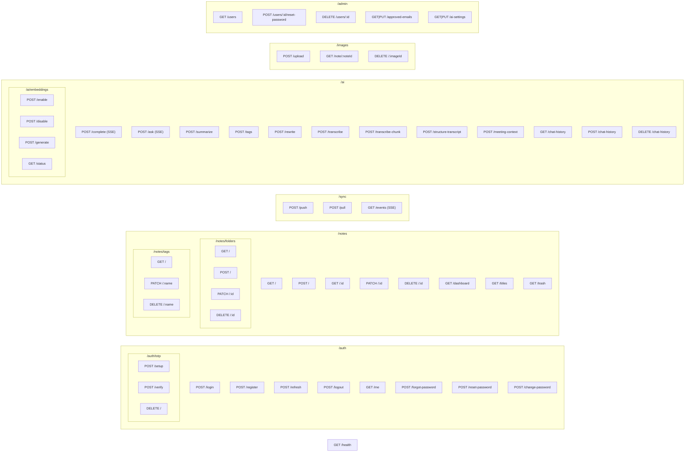

# API Routes

All REST endpoints grouped by route prefix.

```mermaid
flowchart LR
    subgraph Auth["/auth"]
        auth_login["POST /login"]
        auth_register["POST /register"]
        auth_refresh["POST /refresh"]
        auth_logout["POST /logout"]
        auth_me["GET /me"]
        auth_forgot["POST /forgot-password"]
        auth_reset["POST /reset-password"]
        auth_change["POST /change-password"]
        subgraph TOTP["/auth/totp"]
            totp_setup["POST /setup"]
            totp_verify["POST /verify"]
            totp_delete["DELETE /"]
        end
    end

    subgraph Notes["/notes"]
        notes_list["GET /"]
        notes_create["POST /"]
        notes_get["GET /:id"]
        notes_update["PATCH /:id"]
        notes_delete["DELETE /:id"]
        notes_dash["GET /dashboard"]
        notes_titles["GET /titles"]
        notes_trash["GET /trash"]
        subgraph Folders["/notes/folders"]
            folders_list["GET /"]
            folders_create["POST /"]
            folders_update["PATCH /:id"]
            folders_delete["DELETE /:id"]
        end
        subgraph Tags["/notes/tags"]
            tags_list["GET /"]
            tags_rename["PATCH /:name"]
            tags_delete["DELETE /:name"]
        end
    end

    subgraph Sync["/sync"]
        sync_push["POST /push"]
        sync_pull["POST /pull"]
        sync_events["GET /events (SSE)"]
    end

    subgraph AI["/ai"]
        ai_complete["POST /complete (SSE)"]
        ai_ask["POST /ask (SSE)"]
        ai_summarize["POST /summarize"]
        ai_tags["POST /tags"]
        ai_rewrite["POST /rewrite"]
        ai_transcribe["POST /transcribe"]
        ai_chunk["POST /transcribe-chunk"]
        ai_structure["POST /structure-transcript"]
        ai_context["POST /meeting-context"]
        ai_chat_get["GET /chat-history"]
        ai_chat_post["POST /chat-history"]
        ai_chat_del["DELETE /chat-history"]
        subgraph Embeddings["/ai/embeddings"]
            emb_enable["POST /enable"]
            emb_disable["POST /disable"]
            emb_generate["POST /generate"]
            emb_status["GET /status"]
        end
    end

    subgraph Images["/images"]
        img_upload["POST /upload"]
        img_list["GET /note/:noteId"]
        img_delete["DELETE /:imageId"]
    end

    subgraph Admin["/admin"]
        admin_users["GET /users"]
        admin_reset["POST /users/:id/reset-password"]
        admin_delete["DELETE /users/:id"]
        admin_emails["GET|PUT /approved-emails"]
        admin_ai["GET|PUT /ai-settings"]
    end

    health["GET /health"]
```
