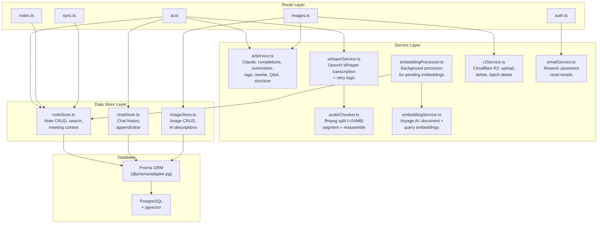

# API Services

Internal service layer connecting routes to external APIs and the database.

```mermaid
flowchart TD
    subgraph Routes["Route Layer"]
        ai_routes["ai.ts"]
        note_routes["notes.ts"]
        sync_routes["sync.ts"]
        image_routes["images.ts"]
        auth_routes["auth.ts"]
    end

    subgraph Services["Service Layer"]
        aiService["aiService.ts\nClaude: completions, summaries,\ntags, rewrite, Q&A, structure"]
        whisperService["whisperService.ts\nOpenAI Whisper transcription\n+ retry logic"]
        audioChunker["audioChunker.ts\nffmpeg split (>24MB)\nsegment + reassemble"]
        embeddingService["embeddingService.ts\nVoyage AI: document +\nquery embeddings"]
        embeddingProcessor["embeddingProcessor.ts\nBackground processor\nfor pending embeddings"]
        r2Service["r2Service.ts\nCloudflare R2: upload,\ndelete, batch delete"]
        emailService["emailService.ts\nResend: password\nreset emails"]
    end

    subgraph Store["Data Store Layer"]
        noteStore["noteStore.ts\nNote CRUD, search,\nmeeting context"]
        chatStore["chatStore.ts\nChat history\nappend/clear"]
        imageStore["imageStore.ts\nImage CRUD,\nAI descriptions"]
    end

    subgraph DB["Database"]
        postgres["PostgreSQL\n+ pgvector"]
        prisma["Prisma ORM\n(@prisma/adapter-pg)"]
    end

    ai_routes --> aiService
    ai_routes --> whisperService
    ai_routes --> chatStore
    ai_routes --> noteStore
    note_routes --> noteStore
    sync_routes --> noteStore
    image_routes --> imageStore
    image_routes --> r2Service
    image_routes --> aiService
    auth_routes --> emailService

    whisperService --> audioChunker
    embeddingProcessor --> embeddingService
    embeddingProcessor --> noteStore

    noteStore --> prisma
    chatStore --> prisma
    imageStore --> prisma
    prisma --> postgres
```
