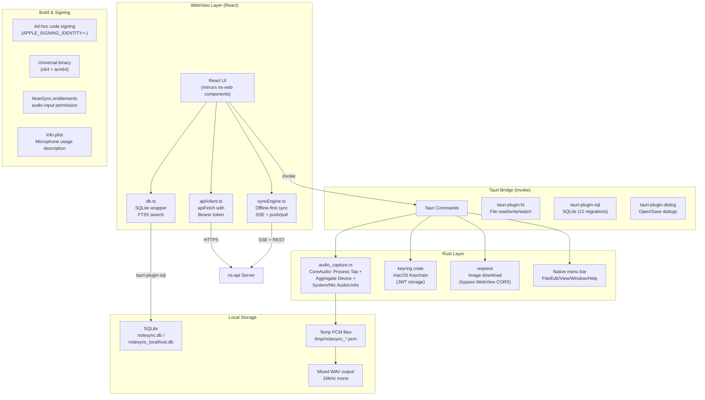

# Desktop App Architecture (Tauri v2)

Layers of the NoteSync desktop application.

```mermaid
flowchart TB
    subgraph WebView["WebView Layer (React)"]
        ui["React UI\n(mirrors ns-web components)"]
        sync["syncEngine.ts\nOffline-first sync\nSSE + push/pull"]
        db_ts["db.ts\nSQLite wrapper\nFTS5 search"]
        api_client["api/client.ts\napiFetch with\nBearer token"]
    end

    subgraph Tauri["Tauri Bridge (invoke)"]
        commands["Tauri Commands"]
        fs_plugin["tauri-plugin-fs\nFile read/write/watch"]
        sql_plugin["tauri-plugin-sql\nSQLite (12 migrations)"]
        dialog_plugin["tauri-plugin-dialog\nOpen/Save dialogs"]
    end

    subgraph Rust["Rust Layer"]
        audio["audio_capture.rs\nCoreAudio: Process Tap +\nAggregate Device +\nSystem/Mic AudioUnits"]
        keyring_rs["keyring crate\nmacOS Keychain\n(JWT storage)"]
        download["reqwest\nImage download\n(bypass WebView CORS)"]
        menu["Native menu bar\nFile/Edit/View/Window/Help"]
    end

    subgraph Storage["Local Storage"]
        sqlite["SQLite\nnotesync.db /\nnotesync_localhost.db"]
        pcm["Temp PCM files\n/tmp/notesync_*.pcm"]
        wav["Mixed WAV output\n16kHz mono"]
    end

    ui --> sync
    ui --> db_ts
    ui --> api_client
    ui -->|invoke| commands

    commands --> audio
    commands --> keyring_rs
    commands --> download
    commands --> menu

    db_ts -->|tauri-plugin-sql| sqlite
    audio --> pcm
    pcm --> wav
    api_client -->|HTTPS| API["ns-api Server"]
    sync -->|SSE + REST| API

    subgraph Signing["Build & Signing"]
        adhoc["Ad-hoc code signing\n(APPLE_SIGNING_IDENTITY=-)"]
        universal["Universal binary\n(x64 + arm64)"]
        entitlements["NoteSync.entitlements\naudio-input permission"]
        plist["Info.plist\nMicrophone usage description"]
    end
```
