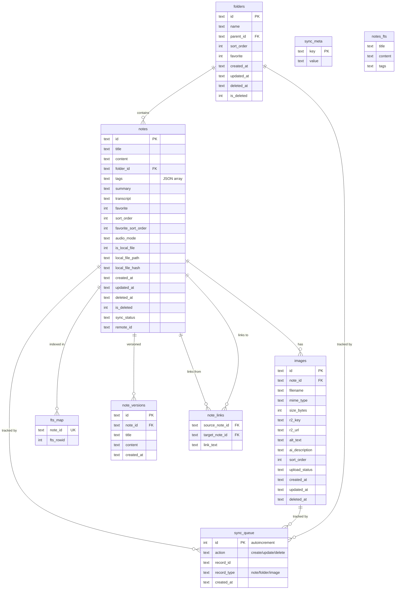

# Desktop SQLite Schema

Local database tables managed by Tauri SQL plugin with 12 migrations.

```mermaid
erDiagram
    notes ||--o{ sync_queue : "tracked by"
    notes ||--o{ fts_map : "indexed in"
    notes ||--o{ note_versions : "versioned"
    notes ||--o{ note_links : "links from"
    notes ||--o{ note_links : "links to"
    notes ||--o{ images : "has"
    folders ||--o{ notes : "contains"
    folders ||--o{ sync_queue : "tracked by"
    images ||--o{ sync_queue : "tracked by"

    notes {
        text id PK
        text title
        text content
        text folder_id FK
        text tags "JSON array"
        text summary
        text transcript
        int favorite
        int sort_order
        int favorite_sort_order
        text audio_mode
        int is_local_file
        text local_file_path
        text local_file_hash
        text created_at
        text updated_at
        text deleted_at
        int is_deleted
        text sync_status
        text remote_id
    }

    folders {
        text id PK
        text name
        text parent_id FK
        int sort_order
        int favorite
        text created_at
        text updated_at
        text deleted_at
        int is_deleted
    }

    images {
        text id PK
        text note_id FK
        text filename
        text mime_type
        int size_bytes
        text r2_key
        text r2_url
        text alt_text
        text ai_description
        int sort_order
        text upload_status
        text created_at
        text updated_at
        text deleted_at
    }

    sync_queue {
        int id PK "autoincrement"
        text action "create/update/delete"
        text record_id
        text record_type "note/folder/image"
        text created_at
    }

    sync_meta {
        text key PK
        text value
    }

    notes_fts {
        text title
        text content
        text tags
    }

    fts_map {
        text note_id UK
        int fts_rowid
    }

    note_versions {
        text id PK
        text note_id FK
        text title
        text content
        text created_at
    }

    note_links {
        text source_note_id FK
        text target_note_id FK
        text link_text
    }
```
