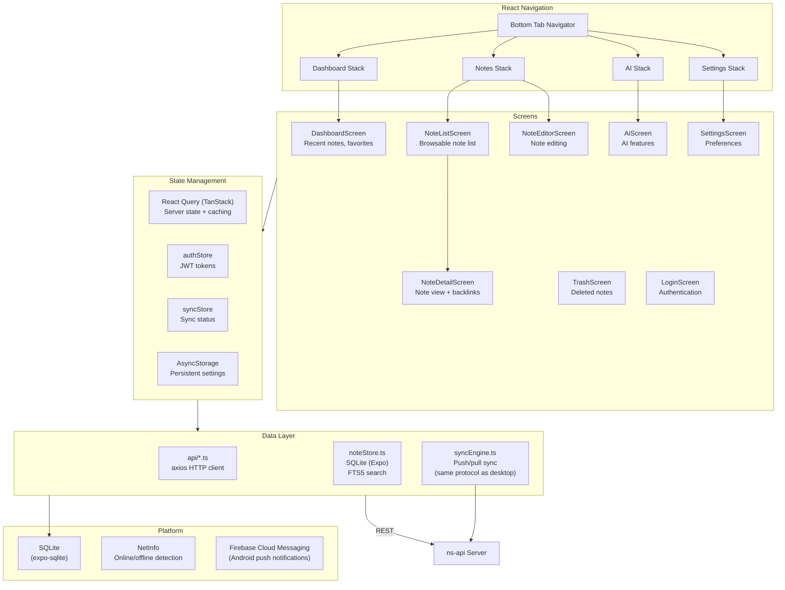

# Mobile App Architecture (React Native + Expo)

NoteSync mobile app structure for Android and iOS.

```mermaid
flowchart TB
    subgraph Navigation["React Navigation"]
        tabs["Bottom Tab Navigator"]
        tabs --> dash_stack["Dashboard Stack"]
        tabs --> notes_stack["Notes Stack"]
        tabs --> ai_stack["AI Stack"]
        tabs --> settings_stack["Settings Stack"]
    end

    subgraph Screens["Screens"]
        dash["DashboardScreen\nRecent notes, favorites"]
        list["NoteListScreen\nBrowsable note list"]
        detail["NoteDetailScreen\nNote view + backlinks"]
        editor["NoteEditorScreen\nNote editing"]
        ai["AiScreen\nAI features"]
        settings["SettingsScreen\nPreferences"]
        trash["TrashScreen\nDeleted notes"]
        login["LoginScreen\nAuthentication"]
    end

    subgraph State["State Management"]
        rq["React Query (TanStack)\nServer state + caching"]
        auth_store["authStore\nJWT tokens"]
        sync_store["syncStore\nSync status"]
        async_storage["AsyncStorage\nPersistent settings"]
    end

    subgraph Data["Data Layer"]
        api_layer["api/*.ts\naxios HTTP client"]
        note_store["noteStore.ts\nSQLite (Expo)\nFTS5 search"]
        sync_engine["syncEngine.ts\nPush/pull sync\n(same protocol as desktop)"]
    end

    subgraph Platform["Platform"]
        sqlite_mobile["SQLite\n(expo-sqlite)"]
        netinfo["NetInfo\nOnline/offline detection"]
        fcm["Firebase Cloud Messaging\n(Android push notifications)"]
    end

    dash_stack --> dash
    notes_stack --> list --> detail
    notes_stack --> editor
    ai_stack --> ai
    settings_stack --> settings

    Screens --> State
    State --> Data
    Data --> sqlite_mobile
    Data -->|REST| API["ns-api Server"]
    sync_engine --> API
```
