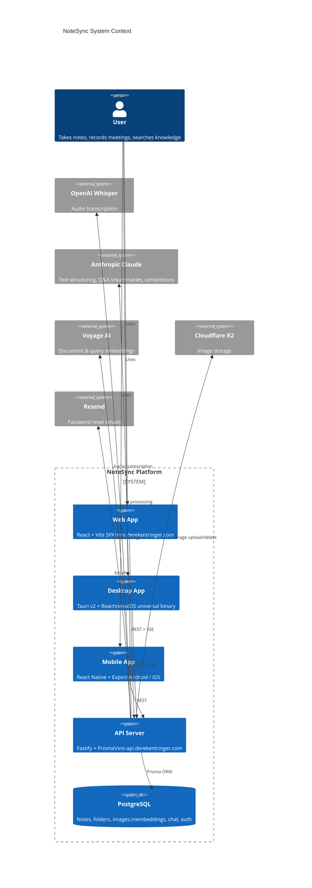

# System Context

High-level view of NoteSync, its users, and external service dependencies.

```mermaid
C4Context
    title NoteSync System Context

    Person(user, "User", "Takes notes, records meetings, searches knowledge")

    System_Boundary(ns, "NoteSync Platform") {
        System(web, "Web App", "React + Vite SPA\nns.derekentringer.com")
        System(desktop, "Desktop App", "Tauri v2 + React\nmacOS universal binary")
        System(mobile, "Mobile App", "React Native + Expo\nAndroid / iOS")
        System(api, "API Server", "Fastify + Prisma\nns-api.derekentringer.com")
        SystemDb(postgres, "PostgreSQL", "Notes, folders, images,\nembeddings, chat, auth")
    }

    System_Ext(whisper, "OpenAI Whisper", "Audio transcription")
    System_Ext(claude, "Anthropic Claude", "Text structuring, Q&A,\nsummaries, completions")
    System_Ext(voyage, "Voyage AI", "Document & query embeddings")
    System_Ext(r2, "Cloudflare R2", "Image storage")
    System_Ext(resend, "Resend", "Password reset emails")

    Rel(user, web, "Uses")
    Rel(user, desktop, "Uses")
    Rel(user, mobile, "Uses")
    Rel(web, api, "REST + SSE")
    Rel(desktop, api, "REST + SSE")
    Rel(mobile, api, "REST")
    Rel(api, postgres, "Prisma ORM")
    Rel(api, whisper, "Audio transcription")
    Rel(api, claude, "AI processing")
    Rel(api, voyage, "Embeddings")
    Rel(api, r2, "Image upload/delete")
    Rel(api, resend, "Emails")
```
