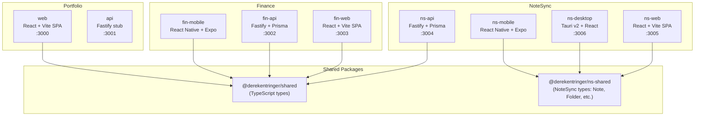

# Package Architecture

Monorepo structure showing all packages and their dependencies.

```mermaid
flowchart TB
    subgraph Shared["Shared Packages"]
        shared["@derekentringer/shared\n(TypeScript types)"]
        ns_shared["@derekentringer/ns-shared\n(NoteSync types: Note, Folder, etc.)"]
    end

    subgraph NoteSync["NoteSync"]
        ns_web["ns-web\nReact + Vite SPA\n:3005"]
        ns_api["ns-api\nFastify + Prisma\n:3004"]
        ns_desktop["ns-desktop\nTauri v2 + React\n:3006"]
        ns_mobile["ns-mobile\nReact Native + Expo"]
    end

    subgraph Finance["Finance"]
        fin_web["fin-web\nReact + Vite SPA\n:3003"]
        fin_api["fin-api\nFastify + Prisma\n:3002"]
        fin_mobile["fin-mobile\nReact Native + Expo"]
    end

    subgraph Portfolio["Portfolio"]
        web["web\nReact + Vite SPA\n:3000"]
        api["api\nFastify stub\n:3001"]
    end

    ns_web --> ns_shared
    ns_desktop --> ns_shared
    ns_mobile --> ns_shared
    ns_api --> shared
    fin_web --> shared
    fin_api --> shared
    fin_mobile --> shared
    web --> shared
```
