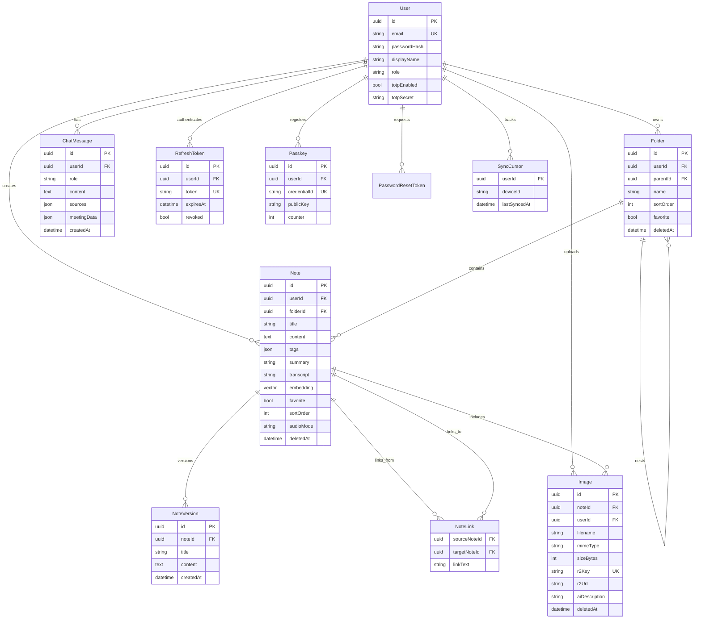

# Entity Relationship Diagram

All PostgreSQL models in the NoteSync API database.

```mermaid
erDiagram
    User ||--o{ Note : creates
    User ||--o{ Folder : owns
    User ||--o{ Image : uploads
    User ||--o{ ChatMessage : has
    User ||--o{ RefreshToken : authenticates
    User ||--o{ Passkey : registers
    User ||--o{ PasswordResetToken : requests
    User ||--o{ SyncCursor : tracks

    Folder ||--o{ Note : contains
    Folder ||--o{ Folder : nests

    Note ||--o{ NoteVersion : versions
    Note ||--o{ NoteLink : links_from
    Note ||--o{ NoteLink : links_to
    Note ||--o{ Image : includes

    User {
        uuid id PK
        string email UK
        string passwordHash
        string displayName
        string role
        bool totpEnabled
        string totpSecret
    }

    Note {
        uuid id PK
        uuid userId FK
        uuid folderId FK
        string title
        text content
        json tags
        string summary
        string transcript
        vector embedding
        bool favorite
        int sortOrder
        string audioMode
        datetime deletedAt
    }

    Folder {
        uuid id PK
        uuid userId FK
        uuid parentId FK
        string name
        int sortOrder
        bool favorite
        datetime deletedAt
    }

    Image {
        uuid id PK
        uuid noteId FK
        uuid userId FK
        string filename
        string mimeType
        int sizeBytes
        string r2Key UK
        string r2Url
        string aiDescription
        datetime deletedAt
    }

    ChatMessage {
        uuid id PK
        uuid userId FK
        string role
        text content
        json sources
        json meetingData
        datetime createdAt
    }

    NoteVersion {
        uuid id PK
        uuid noteId FK
        string title
        text content
        datetime createdAt
    }

    NoteLink {
        uuid sourceNoteId FK
        uuid targetNoteId FK
        string linkText
    }

    SyncCursor {
        uuid userId FK
        string deviceId
        datetime lastSyncedAt
    }

    Passkey {
        uuid id PK
        uuid userId FK
        string credentialId UK
        string publicKey
        int counter
    }

    RefreshToken {
        uuid id PK
        uuid userId FK
        string token UK
        datetime expiresAt
        bool revoked
    }
```
