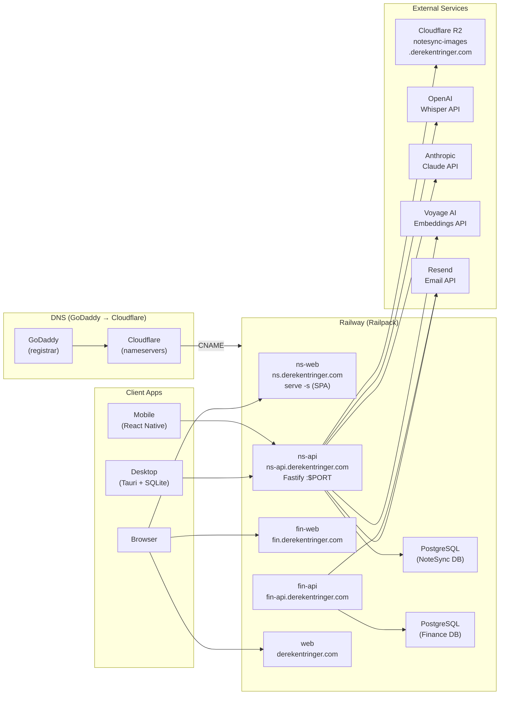

# Deployment Topology

DNS, hosting, and service infrastructure.

```mermaid
flowchart LR
    subgraph DNS["DNS (GoDaddy → Cloudflare)"]
        godaddy["GoDaddy\n(registrar)"]
        cloudflare["Cloudflare\n(nameservers)"]
    end

    subgraph Railway["Railway (Railpack)"]
        ns_web_svc["ns-web\nns.derekentringer.com\nserve -s (SPA)"]
        ns_api_svc["ns-api\nns-api.derekentringer.com\nFastify :$PORT"]
        ns_pg["PostgreSQL\n(NoteSync DB)"]

        fin_web_svc["fin-web\nfin.derekentringer.com"]
        fin_api_svc["fin-api\nfin-api.derekentringer.com"]
        fin_pg["PostgreSQL\n(Finance DB)"]

        web_svc["web\nderekentringer.com"]
    end

    subgraph External["External Services"]
        r2["Cloudflare R2\nnotesync-images\n.derekentringer.com"]
        openai["OpenAI\nWhisper API"]
        anthropic["Anthropic\nClaude API"]
        voyageai["Voyage AI\nEmbeddings API"]
        resend["Resend\nEmail API"]
    end

    subgraph Clients["Client Apps"]
        browser["Browser"]
        tauri["Desktop\n(Tauri + SQLite)"]
        mobile["Mobile\n(React Native)"]
    end

    godaddy --> cloudflare
    cloudflare -->|CNAME| Railway

    browser --> ns_web_svc
    browser --> fin_web_svc
    browser --> web_svc
    tauri --> ns_api_svc
    mobile --> ns_api_svc

    ns_api_svc --> ns_pg
    ns_api_svc --> r2
    ns_api_svc --> openai
    ns_api_svc --> anthropic
    ns_api_svc --> voyageai
    ns_api_svc --> resend

    fin_api_svc --> fin_pg
    fin_api_svc --> resend
```
