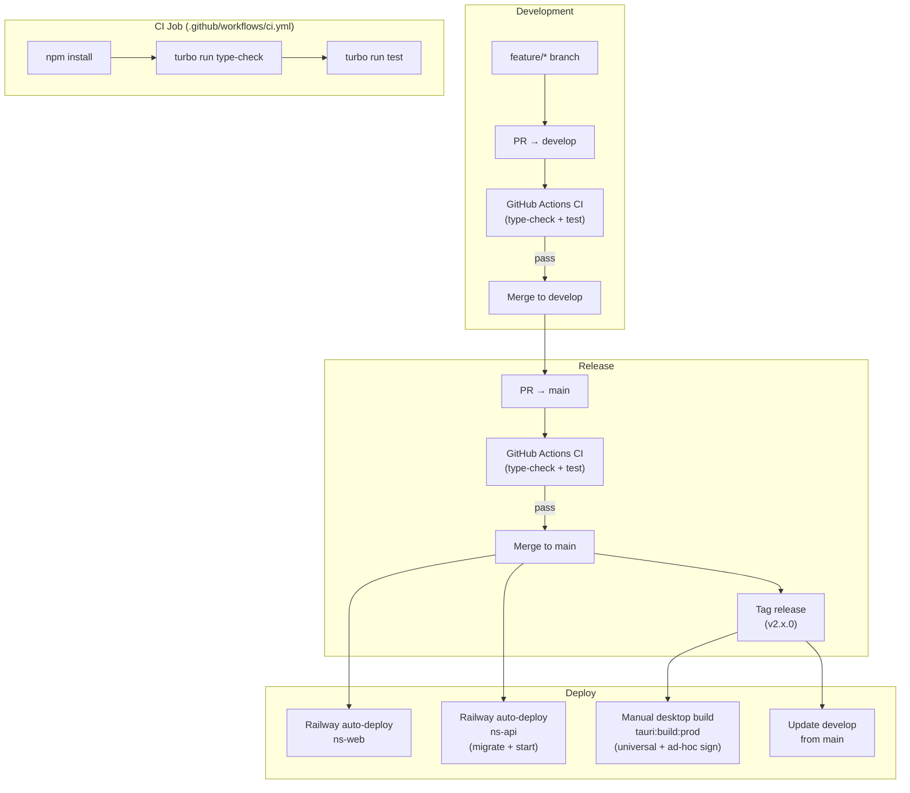

# CI/CD Pipeline

Build, test, and deployment workflow.

```mermaid
flowchart TD
    subgraph Development
        feature["feature/* branch"] --> pr_develop["PR → develop"]
        pr_develop --> ci_develop["GitHub Actions CI\n(type-check + test)"]
        ci_develop -->|pass| merge_develop["Merge to develop"]
    end

    subgraph Release
        merge_develop --> pr_main["PR → main"]
        pr_main --> ci_main["GitHub Actions CI\n(type-check + test)"]
        ci_main -->|pass| merge_main["Merge to main"]
        merge_main --> tag["Tag release\n(v2.x.0)"]
    end

    subgraph Deploy
        merge_main --> railway_web["Railway auto-deploy\nns-web"]
        merge_main --> railway_api["Railway auto-deploy\nns-api\n(migrate + start)"]
        tag --> desktop_build["Manual desktop build\ntauri:build:prod\n(universal + ad-hoc sign)"]
        tag --> update_develop["Update develop\nfrom main"]
    end

    subgraph CI["CI Job (.github/workflows/ci.yml)"]
        ci_step1["npm install"]
        ci_step2["turbo run type-check"]
        ci_step3["turbo run test"]
        ci_step1 --> ci_step2 --> ci_step3
    end
```
