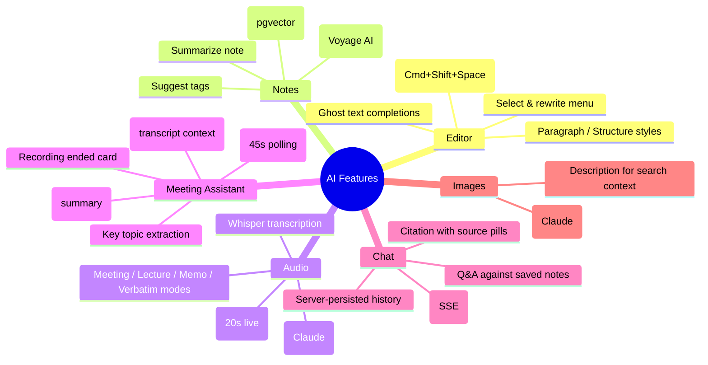

# AI Features

All AI-powered capabilities across the NoteSync platform.

```mermaid
mindmap
    root((AI Features))
        Editor
            Ghost text completions
            Continue writing (Cmd+Shift+Space)
            Paragraph / Structure styles
            Select & rewrite menu
        Notes
            Summarize note
            Suggest tags
            Semantic search (pgvector)
            Note embeddings (Voyage AI)
        Audio
            Whisper transcription
            Chunked transcription (20s live)
            Structure transcript (Claude)
            Meeting / Lecture / Memo / Verbatim modes
        Meeting Assistant
            Related note surfacing (45s polling)
            Live Q&A (transcript context)
            Catch me up (summary)
            Recording ended card
            Key topic extraction
        Chat
            Q&A against saved notes
            Citation with source pills
            Streaming responses (SSE)
            Server-persisted history
        Images
            AI vision analysis (Claude)
            Description for search context
```
