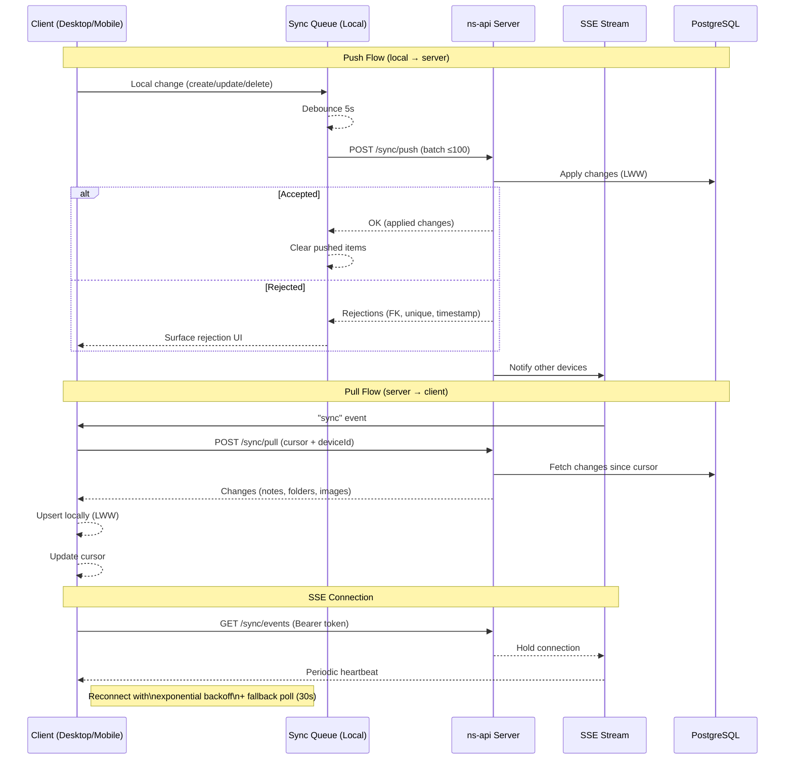

# Sync Engine Flow

Offline-first sync between client apps and the API server. Used by desktop and mobile; web is online-only with offline queue fallback.

```mermaid
sequenceDiagram
    participant Client as Client (Desktop/Mobile)
    participant Queue as Sync Queue (Local)
    participant API as ns-api Server
    participant SSE as SSE Stream
    participant DB as PostgreSQL

    Note over Client,DB: Push Flow (local → server)
    Client->>Queue: Local change (create/update/delete)
    Queue-->>Queue: Debounce 5s
    Queue->>API: POST /sync/push (batch ≤100)
    API->>DB: Apply changes (LWW)
    alt Accepted
        API-->>Queue: OK (applied changes)
        Queue-->>Queue: Clear pushed items
    else Rejected
        API-->>Queue: Rejections (FK, unique, timestamp)
        Queue-->>Client: Surface rejection UI
    end
    API->>SSE: Notify other devices

    Note over Client,DB: Pull Flow (server → client)
    SSE->>Client: "sync" event
    Client->>API: POST /sync/pull (cursor + deviceId)
    API->>DB: Fetch changes since cursor
    API-->>Client: Changes (notes, folders, images)
    Client-->>Client: Upsert locally (LWW)
    Client-->>Client: Update cursor

    Note over Client,SSE: SSE Connection
    Client->>API: GET /sync/events (Bearer token)
    API-->>SSE: Hold connection
    SSE-->>Client: Periodic heartbeat
    Note right of Client: Reconnect with\nexponential backoff\n+ fallback poll (30s)
```
