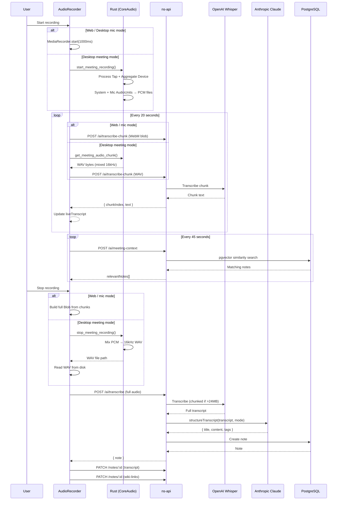

# Audio Recording Pipeline

End-to-end flow from audio capture to structured note creation.

```mermaid
sequenceDiagram
    participant User
    participant Recorder as AudioRecorder
    participant Rust as Rust (CoreAudio)
    participant API as ns-api
    participant Whisper as OpenAI Whisper
    participant Claude as Anthropic Claude
    participant DB as PostgreSQL

    User->>Recorder: Start recording
    alt Web / Desktop mic mode
        Recorder->>Recorder: MediaRecorder.start(1000ms)
    else Desktop meeting mode
        Recorder->>Rust: start_meeting_recording()
        Rust->>Rust: Process Tap + Aggregate Device
        Rust->>Rust: System + Mic AudioUnits → PCM files
    end

    loop Every 20 seconds
        alt Web / mic mode
            Recorder->>API: POST /ai/transcribe-chunk (WebM blob)
        else Desktop meeting mode
            Recorder->>Rust: get_meeting_audio_chunk()
            Rust-->>Recorder: WAV bytes (mixed 16kHz)
            Recorder->>API: POST /ai/transcribe-chunk (WAV)
        end
        API->>Whisper: Transcribe chunk
        Whisper-->>API: Chunk text
        API-->>Recorder: { chunkIndex, text }
        Recorder-->>Recorder: Update liveTranscript
    end

    loop Every 45 seconds
        Recorder->>API: POST /ai/meeting-context
        API->>DB: pgvector similarity search
        DB-->>API: Matching notes
        API-->>Recorder: relevantNotes[]
    end

    User->>Recorder: Stop recording

    alt Web / mic mode
        Recorder->>Recorder: Build full Blob from chunks
    else Desktop meeting mode
        Recorder->>Rust: stop_meeting_recording()
        Rust->>Rust: Mix PCM → 16kHz WAV
        Rust-->>Recorder: WAV file path
        Recorder->>Recorder: Read WAV from disk
    end

    Recorder->>API: POST /ai/transcribe (full audio)
    API->>Whisper: Transcribe (chunked if >24MB)
    Whisper-->>API: Full transcript
    API->>Claude: structureTranscript(transcript, mode)
    Claude-->>API: { title, content, tags }
    API->>DB: Create note
    DB-->>API: Note
    API-->>Recorder: { note }

    Recorder->>API: PATCH /notes/:id (transcript)
    Recorder->>API: PATCH /notes/:id (wiki-links)
```
