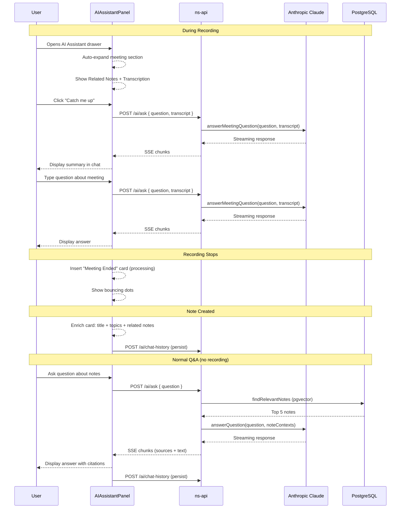

# AI Assistant Flow

Chat interactions during and after a recording session.

```mermaid
sequenceDiagram
    participant User
    participant Panel as AIAssistantPanel
    participant API as ns-api
    participant Claude as Anthropic Claude
    participant DB as PostgreSQL

    Note over User,DB: During Recording
    User->>Panel: Opens AI Assistant drawer
    Panel-->>Panel: Auto-expand meeting section
    Panel-->>Panel: Show Related Notes + Transcription

    User->>Panel: Click "Catch me up"
    Panel->>API: POST /ai/ask { question, transcript }
    API->>Claude: answerMeetingQuestion(question, transcript)
    Claude-->>API: Streaming response
    API-->>Panel: SSE chunks
    Panel-->>User: Display summary in chat

    User->>Panel: Type question about meeting
    Panel->>API: POST /ai/ask { question, transcript }
    API->>Claude: answerMeetingQuestion(question, transcript)
    Claude-->>API: Streaming response
    API-->>Panel: SSE chunks
    Panel-->>User: Display answer

    Note over User,DB: Recording Stops
    Panel-->>Panel: Insert "Meeting Ended" card (processing)
    Panel-->>Panel: Show bouncing dots

    Note over User,DB: Note Created
    Panel-->>Panel: Enrich card: title + topics + related notes
    Panel->>API: POST /ai/chat-history (persist)

    Note over User,DB: Normal Q&A (no recording)
    User->>Panel: Ask question about notes
    Panel->>API: POST /ai/ask { question }
    API->>DB: findRelevantNotes (pgvector)
    DB-->>API: Top 5 notes
    API->>Claude: answerQuestion(question, noteContexts)
    Claude-->>API: Streaming response
    API-->>Panel: SSE chunks (sources + text)
    Panel-->>User: Display answer with citations
    Panel->>API: POST /ai/chat-history (persist)
```
