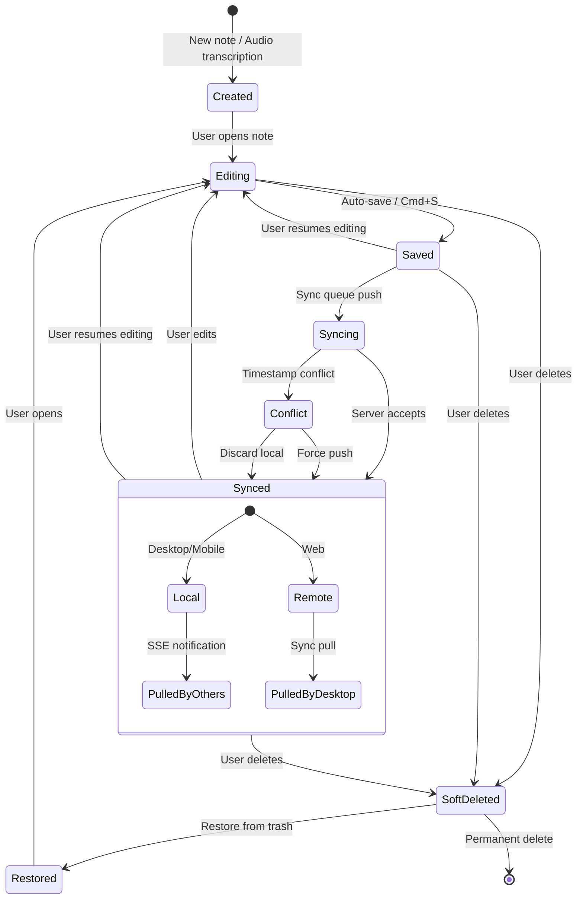

# Note Lifecycle

States a note can be in and transitions between them.

```mermaid
stateDiagram-v2
    [*] --> Created : New note / Audio transcription
    Created --> Editing : User opens note
    Editing --> Saved : Auto-save / Cmd+S
    Saved --> Syncing : Sync queue push
    Syncing --> Synced : Server accepts
    Syncing --> Conflict : Timestamp conflict
    Conflict --> Synced : Force push
    Conflict --> Synced : Discard local
    Synced --> Editing : User edits

    Saved --> Editing : User resumes editing
    Synced --> Editing : User resumes editing

    Editing --> SoftDeleted : User deletes
    Saved --> SoftDeleted : User deletes
    Synced --> SoftDeleted : User deletes

    SoftDeleted --> Restored : Restore from trash
    SoftDeleted --> [*] : Permanent delete

    Restored --> Editing : User opens

    state Synced {
        [*] --> Local : Desktop/Mobile
        [*] --> Remote : Web
        Local --> PulledByOthers : SSE notification
        Remote --> PulledByDesktop : Sync pull
    }
```
