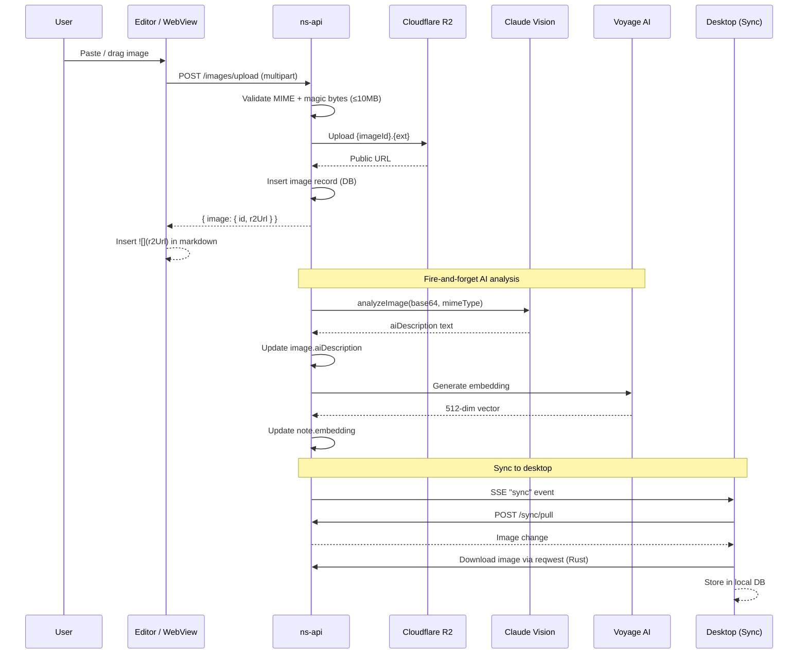

# Image Upload Flow

From paste/drag to storage, AI analysis, and cross-device sync.

```mermaid
sequenceDiagram
    participant User
    participant Editor as Editor / WebView
    participant API as ns-api
    participant R2 as Cloudflare R2
    participant Claude as Claude Vision
    participant Voyage as Voyage AI
    participant Desktop as Desktop (Sync)

    User->>Editor: Paste / drag image
    Editor->>API: POST /images/upload (multipart)
    API->>API: Validate MIME + magic bytes (≤10MB)
    API->>R2: Upload {imageId}.{ext}
    R2-->>API: Public URL
    API->>API: Insert image record (DB)
    API-->>Editor: { image: { id, r2Url } }
    Editor-->>Editor: Insert ![](r2Url) in markdown

    Note over API,Voyage: Fire-and-forget AI analysis
    API->>Claude: analyzeImage(base64, mimeType)
    Claude-->>API: aiDescription text
    API->>API: Update image.aiDescription
    API->>Voyage: Generate embedding
    Voyage-->>API: 512-dim vector
    API->>API: Update note.embedding

    Note over API,Desktop: Sync to desktop
    API->>Desktop: SSE "sync" event
    Desktop->>API: POST /sync/pull
    API-->>Desktop: Image change
    Desktop->>API: Download image via reqwest (Rust)
    Desktop-->>Desktop: Store in local DB
```
