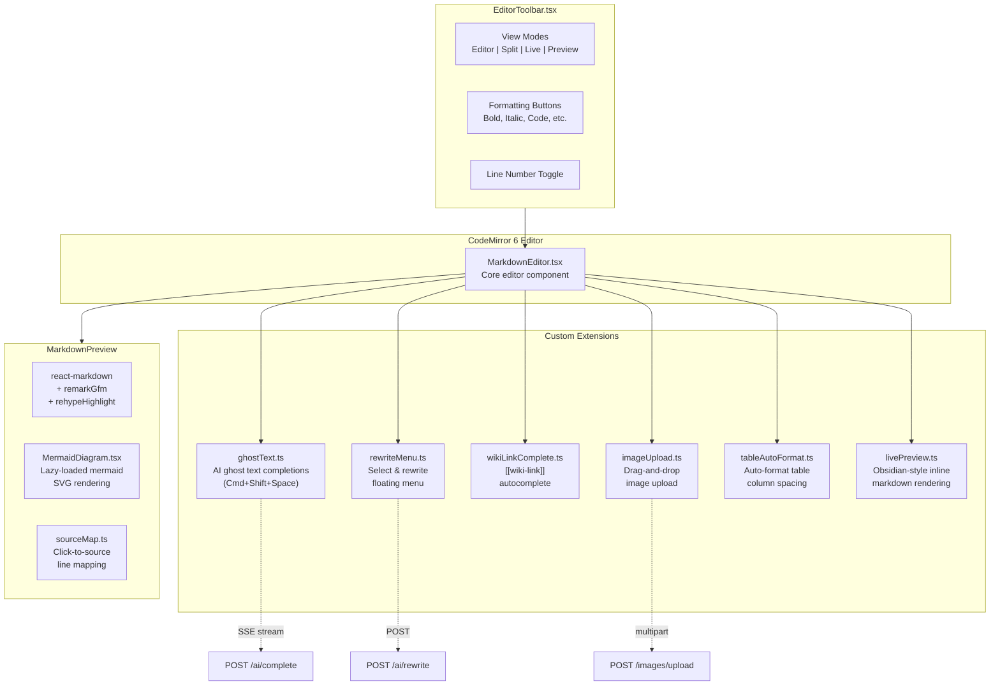

# Editor Architecture

CodeMirror 6 editor with custom extensions for AI, wiki-links, tables, images, and live preview.

```mermaid
flowchart TD
    subgraph Editor["CodeMirror 6 Editor"]
        cm["MarkdownEditor.tsx\nCore editor component"]
    end

    subgraph Extensions["Custom Extensions"]
        ghost["ghostText.ts\nAI ghost text completions\n(Cmd+Shift+Space)"]
        rewrite["rewriteMenu.ts\nSelect & rewrite\nfloating menu"]
        wiki["wikiLinkComplete.ts\n[[wiki-link]]\nautocomplete"]
        img["imageUpload.ts\nDrag-and-drop\nimage upload"]
        table["tableAutoFormat.ts\nAuto-format table\ncolumn spacing"]
        live["livePreview.ts\nObsidian-style inline\nmarkdown rendering"]
    end

    subgraph Toolbar["EditorToolbar.tsx"]
        views["View Modes\nEditor | Split | Live | Preview"]
        format["Formatting Buttons\nBold, Italic, Code, etc."]
        linenum["Line Number Toggle"]
    end

    subgraph Preview["MarkdownPreview"]
        react_md["react-markdown\n+ remarkGfm\n+ rehypeHighlight"]
        mermaid["MermaidDiagram.tsx\nLazy-loaded mermaid\nSVG rendering"]
        source_map["sourceMap.ts\nClick-to-source\nline mapping"]
    end

    cm --> ghost
    cm --> rewrite
    cm --> wiki
    cm --> img
    cm --> table
    cm --> live

    Toolbar --> cm
    cm --> Preview

    ghost -.->|SSE stream| API["POST /ai/complete"]
    rewrite -.->|POST| API2["POST /ai/rewrite"]
    img -.->|multipart| API3["POST /images/upload"]
```
