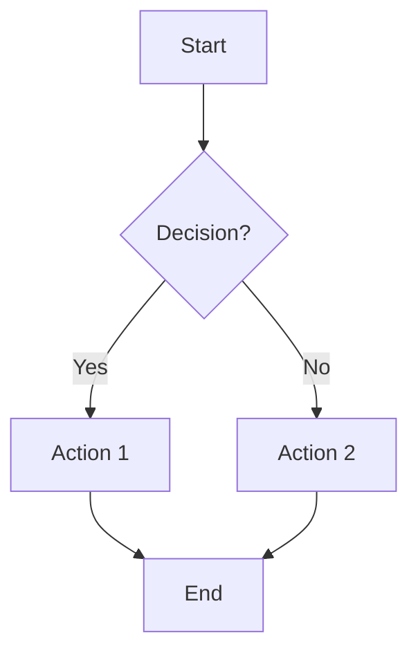

# Markdown Parity Test Fixture

This note exercises every markdown feature ns-mobile aims to support after the parity work in `08-markdown-rendering-parity.md`. Copy the body of this note (everything below the frontmatter) into a new note in the app and visually inspect each section on iOS and Android.

The frontmatter above should be **stripped** by the renderer — if you see the `---` block in the rendered note, frontmatter handling is broken.

---

## 1. Headings (for Table of Contents)

Open the ToC sheet from the header — every heading below should appear, indented by depth. Tapping a heading should scroll to it.

# H1 — Top Level
## H2 — Section
### H3 — Subsection
#### H4 — Sub-subsection
##### H5 — Fifth Level
###### H6 — Sixth Level

---

## 2. Inline Formatting

Plain text. **Bold text.** *Italic text.* ***Bold italic.*** ~~Strikethrough text.~~ `Inline code with backticks.`

A paragraph mixing **bold with `inline code`**, *italic with [a regular link](https://derekentringer.com)*, and ***bold italic with ~~strikethrough~~ in the middle***.

---

## 3. Links

- A regular markdown link: [derekentringer.com](https://derekentringer.com)
- A bare URL (autolink): https://derekentringer.com
- A wiki-link to another note: [[Some Other Note]]
- A wiki-link with an alias: [[Some Other Note|the other doc]]
- An email link: <hi@example.com>

Wiki-links should visually distinguish from regular links (lime accent + dotted underline).

---

## 4. Lists

### 4a. Unordered

- Top-level item
- Another top-level item
  - Second-level
  - Another second-level
    - Third-level
    - Another third-level
- Back to top

### 4b. Ordered

1. First step
2. Second step
3. Third step
   1. Sub-step
   2. Another sub-step
4. Fourth step

### 4c. Task list (interactive checkboxes)

- [x] Done — open Settings
- [ ] Pending — record an audio note
- [x] Done — sync between devices
- [ ] Pending — review meeting transcript
  - [ ] Nested pending item
  - [x] Nested done item
- [ ] Pending — final review

Tapping each checkbox should toggle its state and persist across app reload.

### 4d. Mixed list (plain + task in the same list)

- Plain item
- [ ] Task item
- Another plain item
- [x] Another task item

---

## 5. Blockquotes

> Single-line blockquote.

> Multi-line blockquote
> spanning several lines
> with different content on each line.

> Nested blockquote outer:
> > Inner blockquote
> > continues here.

> Blockquote with **bold text**, *italic*, and `inline code`.

---

## 6. Code Blocks (syntax highlighting target)

### 6a. JavaScript

```js
function greet(name) {
  return `Hello, ${name}!`;
}
console.log(greet("world"));
```

### 6b. TypeScript

```ts
interface User {
  id: string;
  name: string;
  email?: string;
}

const user: User = { id: "1", name: "Derek" };
```

### 6c. Python

```python
def fibonacci(n):
    a, b = 0, 1
    for _ in range(n):
        yield a
        a, b = b, a + b

print(list(fibonacci(10)))
```

### 6d. Bash / Shell

```bash
#!/bin/bash
for file in *.md; do
  echo "Processing $file"
  wc -l "$file"
done
```

### 6e. JSON

```json
{
  "name": "NoteSync",
  "version": "2.41.0",
  "platforms": ["web", "desktop", "mobile"],
  "features": {
    "ai": true,
    "sync": true,
    "audio": true
  }
}
```

### 6f. SQL

```sql
SELECT n.id, n.title, COUNT(t.id) AS tag_count
FROM notes n
LEFT JOIN note_tags nt ON nt.note_id = n.id
LEFT JOIN tags t ON t.id = nt.tag_id
WHERE n.user_id = ?
GROUP BY n.id
ORDER BY n.modified_at DESC
LIMIT 50;
```

### 6g. Plain code fence (no language tag)

```
plain text in a fence
no syntax highlighting expected
just monospace styling + scroll for long lines like this one which intentionally extends beyond the viewport width to test horizontal scrolling
```

### 6h. Inline code references

Reference to `getApiBaseUrl()`, the `EXPO_PUBLIC_BUILD_HASH` env var, the `delete_note` tool, and `[[Wiki Link Style]]` syntax.

---

## 7. GFM Tables

### 7a. Simple table

| Column 1 | Column 2 | Column 3 |
|----------|----------|----------|
| Row 1 A  | Row 1 B  | Row 1 C  |
| Row 2 A  | Row 2 B  | Row 2 C  |
| Row 3 A  | Row 3 B  | Row 3 C  |

### 7b. Aligned table (left / center / right)

| Left aligned | Center aligned | Right aligned |
|:-------------|:--------------:|--------------:|
| L1 short     | C1             | R1            |
| L2 longer    | C2 medium      | R2 long-text  |
| L3           | C3             | R3            |

### 7c. Wide table (should scroll horizontally on phone)

| Lorem | Ipsum | Dolor | Sit | Amet | Consectetur | Adipiscing | Elit | Sed | Do | Eiusmod |
|-------|-------|-------|-----|------|-------------|------------|------|-----|----|---------|
| 1     | 2     | 3     | 4   | 5    | 6           | 7          | 8    | 9   | 10 | 11      |
| A     | B     | C     | D   | E    | F           | G          | H    | I   | J  | K       |

### 7d. Table with inline markdown in cells

| Feature | Status | Notes |
|---------|--------|-------|
| **Tables** | ✅ done | Renders natively |
| *Strikethrough* | ⚠️ verify | ~~Old assumption~~ updated |
| `Inline code` | ✅ done | Monospace inside cell |
| [Link](https://example.com) | ✅ done | Tappable |

---

## 8. Images

A regular image:


An image with no alt text:


---

## 9. Horizontal Rules

Below this paragraph, a horizontal rule using `---`:

---

Below this paragraph, a horizontal rule using `***`:

***

---

## 10. Mermaid Diagram (deferred — should not crash)

For now, this should render as an unstyled code block (or a styled code block with `mermaid` as the language label after Phase 5a). It must not crash the renderer.



---

## 11. Raw HTML Embed

The library may strip, escape, or render this — confirm behavior on each platform.

<div style="padding: 10px; background: #d4e157; color: #000; border-radius: 8px;">
  Raw HTML block. If this appears as a styled lime card, raw HTML renders. If it shows as escaped text, HTML is escaped. If it disappears, HTML is stripped.
</div>

---

## 12. End

If everything above renders as expected, the markdown parity work for that phase is complete.
